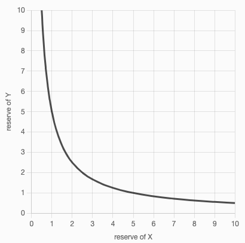

# Decentralised Exchanges

### Birth of DEXs

The idea of a decentralized exchange is simple - allow users to trade their crypto directly on-chain through smart contracts without giving up control of their private keys.

The birth of modern decentralized exchanges was primarily led by [Uniswap](https://uniswap.org/). Not only is Uniswap the leading decentralized exchange on Ethereum, it is THE leading dApp on Ethereum in general.

### The complication

Centralized exchanges typically work on an order-book system.

Order-book based exchanges were attempted on Ethereum, with the most significant example being [0xProject](https://0x.org/) but due to the high gas required for all the storage and matching algorithms, it was challenging to attract users.

### Uniswap V1, V2, V3

**V1**

* Allows only swaps between ether and a token
* Chained swaps were also possible to allow token-token swaps
* Chained swaps would allow for a `TokenA <> TokenB` swap by first swapping one of them for ETH, and then swapping the ETH for the second token.

**V2**

* Huge improvement of V1
* Allows direct swaps between any ERC20 tokens
* Allows chained swaps between any pairs

**V3:**

* Allows liquidity providers to remove a bigger portion of their liquidity from pools and still keep getting the same rewards

### **Market Makers**

<mark style="color:orange;">**Uniswap**</mark> is an **Automated Market Maker**

**Market Makers** are entities that **provide liquidity (assets)** to trading markets

In non-orderbook systems, liquidity is what allows trading to be possible. Example:

* If you want to sell BTC to buy ETH, the exchange must have an ETH balance you can purchase from in exchange for BTC
* Some trading pairs have very high liquidity (eg. BTC/ETH trading pair), but some have extremely low or no liquidity at all (eg. scam tokens, or newly created tokens).

A **DEX must have enough liquidity** to function and serve as an alternative to centralized exchanges.

<mark style="color:orange;">**Uniswap**</mark>** allows anyone to be a market maker**

* This is what makes Uniswap an **automated market maker**
* **Any user can deposit funds to a specific trading pair and add liquidity**, and in exchange **earn** money for doing so **through trading fees taken from the users**.

### Functional Requirements

At the core of Uniswap is one math function:&#x20;

* **x \* y = k**

Assume we have a trading pair for `ETH / LW3 Token`

**x** = reserve balance of `ETH` in the trading pool

**y** = reserve balance of `LW3 Token` in the trading pool

**k** = a constant

This formula is responsible for calculating prices, deciding how much `LW3 Token` would be received in exchange for a certain amount of `ETH`, or vice versa.

**NOTE: It doesn't matter if we use `x` to represent the reserve of `ETH` or `LW3 Token` as long as `y` represents the opposite.**

Let's try to write that as a formula:

**`(x + Δx) * (y - Δy) = k`**

**`Δx`** is the amount being provided by the user for sale&#x20;

**`Δy`** is the amount the user is receiving from the DEX in exchange for `Δx`.

Since **`k`** is a constant, we can compare the above two formulas to get:

* **Δy = (y \* Δx) / (x + Δx)**

**In solidity:**


```solidity
function calculateOutputAmount(
    uint inputAmount, 
    uint inputReserve, 
    uint outputReserve) private pure returns (uint) {    
    uint outputAmount = (outputReserve * inputAmount) / (inputReserve + inputAmount);
    return outputAmount;
}
```


**Example:**

Assume we have `100 ETH` and `200 LW3 Token` in the contract.

**What would happen if I want to swap 1 `ETH` for `LW3 Tokens`? Let's do the math.**

`inputAmount` = 1 ETH `inputReserve` = 100 ETH `outputReserve` = 200 LW3 Tokens

\=> `outputAmount` = `1.98019802` `LW3 Tokens`

**What would happen if instead I wanted to swap 2 `LW3 Tokens` for ETH?**

`inputAmount` = 2 LW3 Tokens `inputReserve` = 200 LW3 Tokens `outputReserve` = 100 ETH

\=> `outputAmount` = `0.999` `ETH`

These amounts are very close to the `1:2` ratio of tokens present in the contract reserves, but slightly smaller. Why?

The product formula we use for price calculations is actually a hyperbola.



### Slippage

Since we don't get tokens in the exact ratio of reserves, this leads to an interesting implication of the math. The price function causes **slippage** in the price.

The bigger the amount of tokens being traded relative to their reserve values, the lower the price would be.

**Example:**

Let's say I wanted to try to drain out the entire pool, and sell `200 ETH`.

`inputAmount` = 200 ETH `inputReserve` = 100 ETH `outputReserve` = 200 LW3 Tokens

\=> `outputAmount` = `133.333` LW3 Tokens

\=> As you can see, when we're trying to drain out the pool, we're only getting close to a half of what we expect.

Some may see this as a flaw of automated market makers that follow `x*y = k`, but it's actually not. It is the same mechanism that protects pools from being completely drained.&#x20;

**This also aligns with the law of supply and demand: the higher the demand relative to the supply, the more costly it is to buy that supply.**


