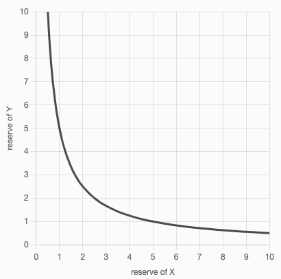

# EVM

The Ethereum network exists solely for the purpose of keeping the single, continuous, uninterrupted, and immutable operation of the state machine that is the Ethereum blockchain.

<figure><figcaption>
Ethereum Application Stack
</figcaption></figure>

### Ethereum as a State Machine

<figure><figcaption>
EVM
</figcaption></figure>

### Ethereum State Transition

The EVM behaves similar to a mathematical state transition function. Given the current state, and a new set of valid transactions, it produces a new state.

**Y(S, T) = S'**

Given the old valid state `S`, and a new set of valid transactions `T`, the state transition function `Y` produces the new valid state `S'`.

The state in Ethereum is stored as a really large data structure called a [Merkle Patricia Trie](https://ethereum.org/en/developers/docs/data-structures-and-encoding/patricia-merkle-trie/).&#x20;

### EVM Layer

The EVM lives as a layer in the software stack of Ethereum.

<figure><figcaption>
Software Stack of Ethereum
</figcaption></figure>

Ethereum nodes contain implementations of the EVM, and the EVM can then execute EVM code on it.&#x20;

**EVM code is compiled smart contract bytecode that can be executed.**

### EVM Code Generation

<figure><figcaption></figcaption></figure>

<figure><figcaption></figcaption></figure>

### EVM Instructions (OPCODES)

The EVM itself behaves as a [stack machine](https://en.wikipedia.org/wiki/Stack\_machine) with a maximum depth of 1024 items on the stack. Each item in the stack is a 256-bit (32 bytes) word.

During execution, the EVM maintains a transient **memory**, as a 32 byte addressed byte array, which does not persist between transactions. The transient memory is cleared when a new transaction is being executed.

**Smart contracts, however, do maintain their own state in the blockchain.** This state is also modelled as a [Merkle Patricia Trie](https://ethereum.org/en/developers/docs/data-structures-and-encoding/patricia-merkle-trie/).&#x20;

**This is commonly referred to as EVM storage during transaction execution.**

The EVM has logic present that allows it to execute [EVM Opcodes](https://ethereum.org/en/developers/docs/evm/opcodes/), which perform standard operations on the stack like `XOR`, `ADD`, `AND`, `SUB`, `MUL` etc. The EVM also implements a number of blockchain-specific stack operations, such as `BALANCE` and `BLOCKHASH`.

When a smart contract is compiled into bytecode (represented in hexadecimal), it compiles down to EVM opcodes. These opcodes are what get executed on the EVM.

<figure><figcaption></figcaption></figure>

### EVM Implementations

All implementations of the EVM must adhere to the specification described in the [Ethereum Yellowpaper](https://ethereum.github.io/yellowpaper/paper.pdf). Over Ethereum's history, the EVM has undergone multiple revisions, and there now exist multiple implementations of the EVM in various programming languages.

All Ethereum clients include an EVM implementation. In addition to those, there are multiple standalone implementations as well.

#### Ethereum Clients (with EVM)

* [Geth](https://geth.ethereum.org/) | Programming Language = Go
* [OpenEthereum](https://github.com/openethereum/openethereum) | Programming Language = Rust
* [Nethermind](https://nethermind.io/) | Programming Language = C# (.NET)
* [Besu](https://consensys.net/quorum/developers/) | Programming Language = Java
* [Erigon](https://github.com/ledgerwatch/erigon) | Programming Language = Go

